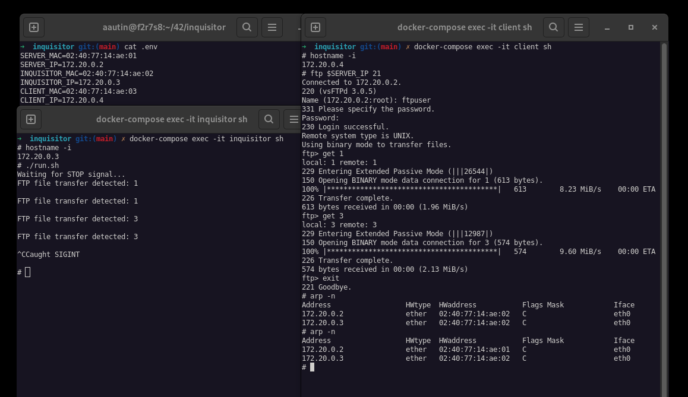
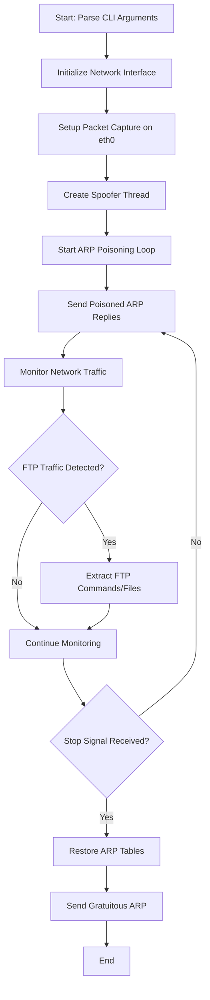

# Inquisitor - ARP Spoofing Tool

## Demo

## Workflow Diagram

- **Initialization Phase**: Parses source/target IP/MAC addresses and sets up packet capture interface.
- **ARP Poisoning Phase**: Continuously sends spoofed ARP replies to redirect traffic through the inquisitor.
- **Traffic Monitoring Phase**: Intercepts and analyzes network packets, specifically monitoring FTP file transfers.
- **Cleanup Phase**: On termination, restores original ARP tables to return network to normal state.

## Network Testing Environment

Three containers for network security testing:
- **Server** : FTP Server (PORT 21) with test files
- **Client** : Client machine for network operations  
- **Inquisitor** : ARP spoofing tool for man-in-the-middle attacks

## Requirements

- Docker & Docker Compose
- Linux environment with network capabilities